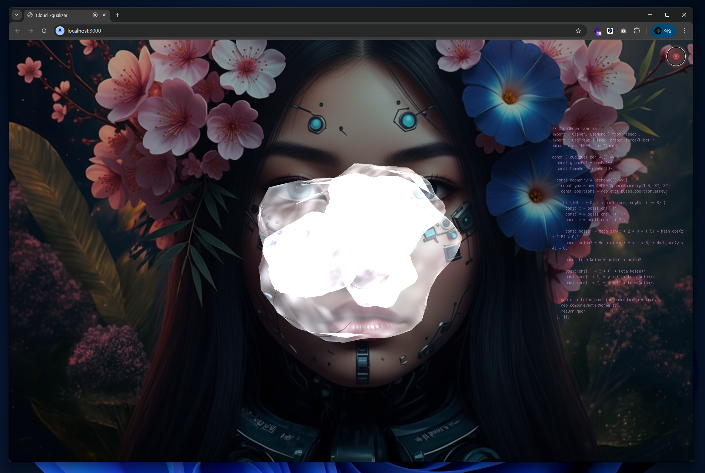

# Cloud Equalizer 🎵☁️

> 소리에 반응하는 3D 구름 이퀄라이저 - 음악과 함께 춤추는 구름들을 경험해보세요!



**React.js**, **Three.js**, **WebGL**을 사용하여 실시간 오디오 시각화를 구현한 인터랙티브 웹 애플리케이션입니다.

## ✨ 주요 기능

- 🎤 **실시간 마이크 입력** - 마이크를 통한 실시간 오디오 분석
- ☁️ **3D 볼류메트릭 구름** - 현실적인 3D 구름 렌더링
- 🎵 **주파수별 반응** - 베이스와 트레블에 따른 다른 시각 효과
- 🌈 **오디오 반응형 색상** - 소리에 따라 변화하는 구름 색상
- 💻 **실시간 코드 스크롤** - 오른쪽에 프로젝트 코드가 스크롤되는 사이버펑크 효과
- 🖼️ **커스텀 배경** - veo.png 배경 이미지 지원
- 🎮 **인터랙티브 카메라** - 마우스로 3D 뷰 조작 가능

## 🚀 빠른 시작

### 설치

```bash
# 저장소 클론
git clone https://github.com/your-username/cloud-equalizer.git
cd cloud-equalizer

# 의존성 설치
npm install

# 개발 서버 시작
npm start
```

브라우저에서 `http://localhost:3000`으로 접속하세요.

### 사용법

1. **🎤 마이크 아이콘 클릭** - 오른쪽 상단의 마이크 버튼을 클릭
2. **권한 허용** - 브라우저에서 마이크 접근 권한을 허용
3. **음악 재생** - 음악을 재생하거나 소리를 내면 구름이 반응합니다
4. **카메라 조작** - 마우스 드래그로 3D 뷰를 회전시킬 수 있습니다

## 🎨 스크린샷


*실시간으로 음악에 반응하는 3D 구름들과 사이버펑크 스타일의 코드 스크롤러*

## 🛠️ 기술 스택

### Frontend
- **React.js** `^18.2.0` - UI 프레임워크
- **Three.js** `^0.160.0` - 3D 그래픽스 라이브러리
- **@react-three/fiber** `^8.15.19` - React Three.js 통합
- **WebGL** - 하드웨어 가속 렌더링

### Audio Processing
- **Web Audio API** - 실시간 오디오 분석
- **AudioContext** - 오디오 컨텍스트 관리
- **AnalyserNode** - 주파수 분석

### Shaders
- **GLSL** - 커스텀 버텍스/프래그먼트 셰이더
- **볼류메트릭 렌더링** - 현실적인 구름 효과

## 📁 프로젝트 구조

```
src/
├── components/
│   ├── CloudEqualizer.js    # 3D 구름 렌더링 및 오디오 반응
│   ├── AudioController.js   # 마이크 입력 및 UI 컨트롤
│   ├── CameraControls.js    # 3D 카메라 조작
│   ├── CodeScroller.js      # 실시간 코드 스크롤러
│   └── CodeScroller.css     # 코드 스크롤러 스타일
├── store/
│   └── audioStore.js        # 오디오 데이터 상태 관리
├── App.js                   # 메인 애플리케이션
├── App.css                  # 글로벌 스타일
└── index.js                 # 엔트리 포인트
```

## 🎯 주요 특징

### 🌤️ 현실적인 구름 렌더링
- 프랙탈 노이즈 기반 구름 형태 생성
- 커스텀 GLSL 셰이더로 볼류메트릭 효과
- 프레넬 효과와 서브서피스 스캐터링

### 🎵 오디오 반응 시스템
- 실시간 FFT 분석 (256 샘플)
- 베이스/트레블 주파수 분리
- 높이별 차등 반응 (베이스는 아래, 트레블은 위)

### 💫 시각 효과
- 오디오 레벨에 따른 구름 변형
- 색상 변화 (베이스: 파란빛, 트레블: 따뜻한 빛)
- 부드러운 애니메이션과 회전

### 🖥️ 사이버펑크 UI
- 반투명 마이크 컨트롤 (펄스 애니메이션)
- 실시간 코드 스크롤러 (글리치 효과)
- 커스텀 배경 이미지 지원

## 🌐 브라우저 호환성

| 브라우저 | 지원 버전 | 특이사항 |
|---------|----------|---------|
| Chrome | 80+ | ✅ 완전 지원 |
| Firefox | 75+ | ✅ 완전 지원 |
| Safari | 14+ | ✅ 완전 지원 |
| Edge | 80+ | ✅ 완전 지원 |

### 요구사항
- **HTTPS 환경** - 마이크 접근을 위해 필요
- **WebGL 지원** - 3D 렌더링을 위해 필요
- **Web Audio API** - 오디오 분석을 위해 필요

## 🎮 사용 팁

- **최적의 경험**: 헤드폰이나 스피커로 음악을 재생하세요
- **카메라 조작**: 마우스 드래그로 구름을 다양한 각도에서 감상
- **오디오 품질**: 다양한 장르의 음악으로 다른 반응을 확인해보세요
- **성능**: 고사양 그래픽 카드에서 더 부드러운 애니메이션 경험

## 📄 라이선스

MIT License - 자유롭게 사용, 수정, 배포 가능합니다.

## 🤝 기여하기

1. Fork the Project
2. Create your Feature Branch (`git checkout -b feature/AmazingFeature`)
3. Commit your Changes (`git commit -m 'Add some AmazingFeature'`)
4. Push to the Branch (`git push origin feature/AmazingFeature`)
5. Open a Pull Request

---

**Made with ❤️ and ☁️ by [Your Name]**

*음악과 함께 춤추는 구름들을 경험해보세요!*